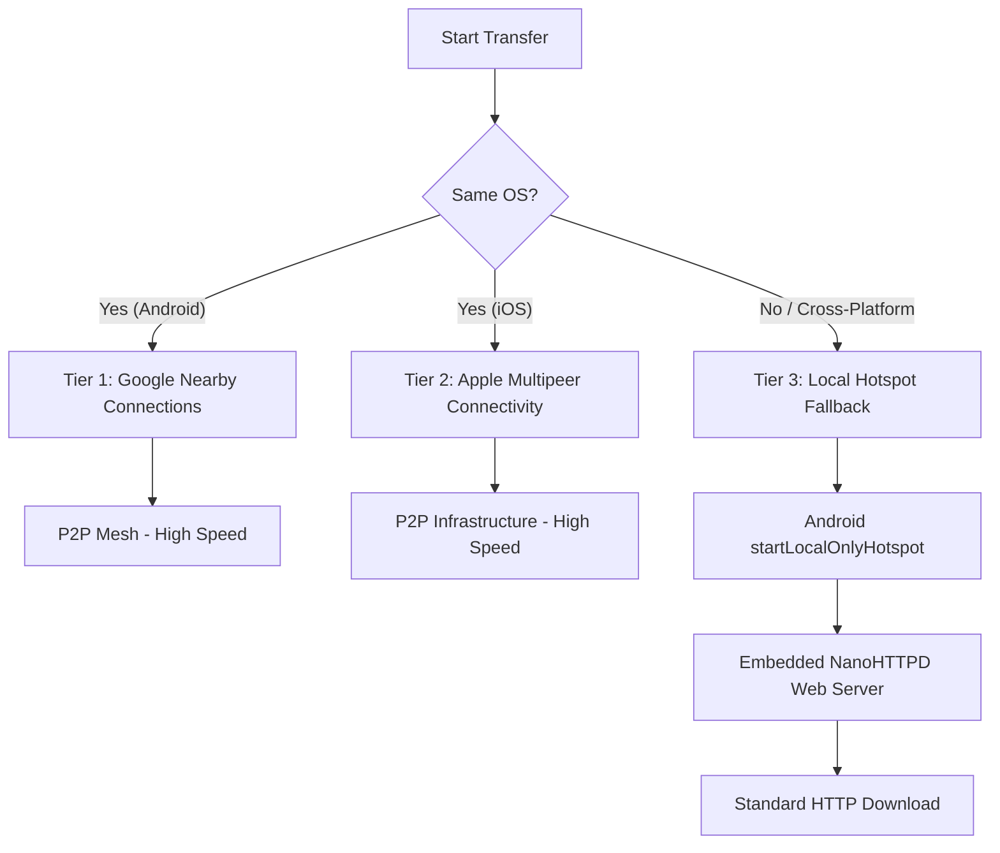

# @picsa/capacitor-offline-transfer

A bespoke Capacitor plugin designed for **completely offline, cross-device large file sharing** (50MB+ videos and Universal APKs). Engineered specifically for rural environments with zero internet connectivity, this plugin operates as a multi-tier transfer engine to ensure maximum compatibility across device types.

## 🚀 The Three-Tier Architecture

To survive the constraints of offline field work, the plugin utilizes three distinct communication tiers:



### Tier 1: Android-to-Android

Utilizes the **Google Nearby Connections API** (Strategy: `P2P_CLUSTER`). This provides a high-speed, offline mesh network capable of multi-device transfers.

### Tier 2: iOS-to-iOS

Utilizes **Apple's Multipeer Connectivity** framework. Handles discovery and session management natively for seamless Apple-to-Apple transfers.

### Tier 3: Cross-Platform / Uninstalled Devices (The Fallback)

When cross-platform communication is required, or the receiving device doesn't have the app:

1. The Android device spins up a **Local Only Hotspot** (`startLocalOnlyHotspot`).
2. An embedded **NanoHTTPD** web server starts, serving files (including the Universal APK) via standard HTTP.
3. The receiver connects to the WiFi and downloads the file via a standard browser or QR code.

---

## 🛠 Technical Constraints & Performance

This plugin is optimized for low-end devices in rural environments:

- **No In-Memory Buffering**: We never use byte arrays for large files. All transfers use `Payload.Type.FILE` with `ParcelFileDescriptor` (Android) and `sendResource` (iOS) to prevent **Out of Memory (OOM)** crashes.
- **Scoped Storage (Android 11+)**: Respects modern Android security. Downloaded files are saved directly to the app's private `Context.getFilesDir()`, accessible via `Capacitor.convertFileSrc()`.
- **Universal APK Sharing**: Built-in support for sharing the app itself via the Tier 3 web server.

---

## Install

```bash
npm install @picsa/capacitor-offline-transfer
npx cap sync
```

## Basic Usage

### 1. Initialization

// serviceId ensures your app only connects to other instances of your app.
// For iOS compatibility: 1-15 chars, lowercase, and hyphens only.
await OfflineTransfer.initialize({ serviceId: 'picsa-xfer' }); 
```

> [!TIP]
> Choose a unique, short name for your service (e.g., `company-app`). This string will also be used in your iOS `Info.plist` configuration.

### 2. Large File Transfer (OOM-Safe)

```typescript
// Sending a 100MB video
await OfflineTransfer.sendFile({
  endpointId: 'peer-123',
  filePath: 'path/to/video.mp4', // Local file URL
  fileName: 'training_video.mp4',
});
```

### 3. Tier 3 Fallback (Hotspot & Server)

```typescript
// On the Host (Android)
const hotspot = await OfflineTransfer.startLocalHotspot();
// hotspot returns { ssid: '...', password: '...' }

const server = await OfflineTransfer.startServer({ port: 8080 });
// server returns { port: 8080, url: 'http://192.168.43.1:8080/app.apk' }
```

## Event Handling

```typescript
// Monitor transfer progress
OfflineTransfer.addListener('transferProgress', event => {
  const percentage = (event.bytesTransferred / event.totalBytes) * 100;
  console.log(`Transfer ${event.payloadId}: ${percentage.toFixed(2)}%`);
});

// Handle successful file reception
OfflineTransfer.addListener('fileReceived', event => {
  console.log(`File saved to: ${event.path}`);
  // Use Capacitor.convertFileSrc(event.path) to display in WebView
});
```

## Platform Configuration

### Android Configuration

#### Permissions

This plugin automatically includes the required permissions via **Manifest Merging**. You do not need to add them manually to your app's `AndroidManifest.xml`.

The following permissions are requested by the plugin:

```xml
<uses-permission android:name="android.permission.INTERNET" />
<uses-permission android:name="android.permission.ACCESS_WIFI_STATE" />
<uses-permission android:name="android.permission.CHANGE_WIFI_STATE" />
<uses-permission android:maxSdkVersion="30" android:name="android.permission.BLUETOOTH" />
<uses-permission android:maxSdkVersion="30" android:name="android.permission.BLUETOOTH_ADMIN" />
<uses-permission android:name="android.permission.ACCESS_COARSE_LOCATION" />
<uses-permission android:minSdkVersion="29" android:name="android.permission.ACCESS_FINE_LOCATION" />
<uses-permission android:minSdkVersion="31" android:name="android.permission.BLUETOOTH_ADVERTISE" />
<uses-permission android:minSdkVersion="31" android:name="android.permission.BLUETOOTH_CONNECT" />
<uses-permission android:minSdkVersion="31" android:name="android.permission.BLUETOOTH_SCAN" />
<uses-permission android:minSdkVersion="32" android:name="android.permission.NEARBY_WIFI_DEVICES" />
```

##### Why are these required?

To ensure the transfer engine survives the constraints of rural deployments, many of these permissions are strictly required for backwards compatibility:

- **Location Permissions (`ACCESS_FINE_LOCATION`)**: On Android 11 and below, Bluetooth and Wi-Fi scanning (used by Nearby Connections) are tied to Location services. Without this permission, the API will fail to discover or advertise on older devices.
- **Bluetooth & Wi-Fi Permissions**: Required for Tier 1 (Nearby Connections) and Tier 3 (Local Hotspot) to establish socket connections and manage high-speed data transfers.
- **Nearby WiFi Devices**: Introduced in Android 13 to allow Wi-Fi operations without needing Location access on newer devices.

#### Requesting Permissions

For Android 6.0+ and especially Android 12+, you must request these permissions at runtime before using the plugin functions. You can use the built-in Capacitor permission methods:

```typescript
import { OfflineTransfer } from '@picsa/capacitor-offline-transfer';

const check = await OfflineTransfer.checkPermissions();
if (check.nearby !== 'granted') {
  await OfflineTransfer.requestPermissions();
}
```

### iOS Configuration

> [!IMPORTANT] > **Manual configuration is required** for iOS. Unlike Android, Capacitor cannot automatically modify your `Info.plist`.

Add these to your `Info.plist`:

```xml
<key>NSBluetoothAlwaysUsageDescription</key>
<string>Required for P2P device discovery</string>
<key>NSLocalNetworkUsageDescription</key>
<string>Required for Multipeer Connectivity data transfer</string>
<key>NSBonjourServices</key>
<array>
  <string>_off-transfer._tcp</string>
  <string>_off-transfer._udp</string>
</array>
```

---

## API

<docgen-index>

* [`initialize(...)`](#initialize)
* [`setStrategy(...)`](#setstrategy)
* [`startAdvertising(...)`](#startadvertising)
* [`stopAdvertising()`](#stopadvertising)
* [`startDiscovery()`](#startdiscovery)
* [`stopDiscovery()`](#stopdiscovery)
* [`connect(...)`](#connect)
* [`acceptConnection(...)`](#acceptconnection)
* [`rejectConnection(...)`](#rejectconnection)
* [`disconnectFromEndpoint(...)`](#disconnectfromendpoint)
* [`disconnect()`](#disconnect)
* [`sendMessage(...)`](#sendmessage)
* [`sendFile(...)`](#sendfile)
* [`startLocalHotspot()`](#startlocalhotspot)
* [`stopLocalHotspot()`](#stoplocalhotspot)
* [`startServer(...)`](#startserver)
* [`stopServer()`](#stopserver)
* [`setLogLevel(...)`](#setloglevel)
* [`addListener('connectionRequested', ...)`](#addlistenerconnectionrequested-)
* [`addListener('connectionResult', ...)`](#addlistenerconnectionresult-)
* [`addListener('endpointFound', ...)`](#addlistenerendpointfound-)
* [`addListener('endpointLost', ...)`](#addlistenerendpointlost-)
* [`addListener('messageReceived', ...)`](#addlistenermessagereceived-)
* [`addListener('transferProgress', ...)`](#addlistenertransferprogress-)
* [`addListener('fileReceived', ...)`](#addlistenerfilereceived-)
* [`checkPermissions()`](#checkpermissions)
* [`requestPermissions()`](#requestpermissions)
* [`removeAllListeners()`](#removealllisteners)
* [Interfaces](#interfaces)
* [Type Aliases](#type-aliases)

</docgen-index>

<docgen-api>
<!--Update the source file JSDoc comments and rerun docgen to update the docs below-->

### initialize(...)

```typescript
initialize(options: { serviceId: string; }) => Promise<void>
```

Initializes the plugin with a unique service identifier.

The `serviceId` is used to isolate your app's communication from other apps using this plugin.
Only devices using the same `serviceId` will be able to discover and connect to each other.

| Param         | Type                                | Description            |
| ------------- | ----------------------------------- | ---------------------- |
| **`options`** | <code>{ serviceId: string; }</code> | Initialization options |

--------------------


### setStrategy(...)

```typescript
setStrategy(options: { strategy: 'P2P_STAR' | 'P2P_CLUSTER' | 'P2P_POINT_TO_POINT'; }) => Promise<void>
```

Sets the P2P connection strategy. 
Defaults to P2P_CLUSTER for mesh support on Android.

| Param         | Type                                                                            | Description                                                |
| ------------- | ------------------------------------------------------------------------------- | ---------------------------------------------------------- |
| **`options`** | <code>{ strategy: 'P2P_STAR' \| 'P2P_CLUSTER' \| 'P2P_POINT_TO_POINT'; }</code> | Strategy ("P2P_STAR", "P2P_CLUSTER", "P2P_POINT_TO_POINT") |

--------------------


### startAdvertising(...)

```typescript
startAdvertising(options: { displayName: string; }) => Promise<void>
```

Starts advertising the device to nearby peers.

| Param         | Type                                  |
| ------------- | ------------------------------------- |
| **`options`** | <code>{ displayName: string; }</code> |

--------------------


### stopAdvertising()

```typescript
stopAdvertising() => Promise<void>
```

Stops advertising.

--------------------


### startDiscovery()

```typescript
startDiscovery() => Promise<void>
```

starts discovery of nearby peers.

--------------------


### stopDiscovery()

```typescript
stopDiscovery() => Promise<void>
```

Stops discovery.

--------------------


### connect(...)

```typescript
connect(options: { endpointId: string; displayName: string; }) => Promise<void>
```

Requests a connection to a discovered endpoint.

| Param         | Type                                                      |
| ------------- | --------------------------------------------------------- |
| **`options`** | <code>{ endpointId: string; displayName: string; }</code> |

--------------------


### acceptConnection(...)

```typescript
acceptConnection(options: { endpointId: string; }) => Promise<void>
```

Accepts an incoming connection request.

| Param         | Type                                 |
| ------------- | ------------------------------------ |
| **`options`** | <code>{ endpointId: string; }</code> |

--------------------


### rejectConnection(...)

```typescript
rejectConnection(options: { endpointId: string; }) => Promise<void>
```

Rejects an incoming connection request.

| Param         | Type                                 |
| ------------- | ------------------------------------ |
| **`options`** | <code>{ endpointId: string; }</code> |

--------------------


### disconnectFromEndpoint(...)

```typescript
disconnectFromEndpoint(options: { endpointId: string; }) => Promise<void>
```

Disconnects from a specific endpoint.

| Param         | Type                                 |
| ------------- | ------------------------------------ |
| **`options`** | <code>{ endpointId: string; }</code> |

--------------------


### disconnect()

```typescript
disconnect() => Promise<void>
```

Disconnects from all connected endpoints.

--------------------


### sendMessage(...)

```typescript
sendMessage(options: { endpointId: string; data: string; }) => Promise<void>
```

Sends a small text message to a connected endpoint.

| Param         | Type                                               |
| ------------- | -------------------------------------------------- |
| **`options`** | <code>{ endpointId: string; data: string; }</code> |

--------------------


### sendFile(...)

```typescript
sendFile(options: { endpointId: string; filePath: string; fileName: string; }) => Promise<void>
```

Sends a large file to a connected endpoint.
Uses Payload.Type.FILE (Android) or Resource URLs (iOS) to avoid OOM.

| Param         | Type                                                                     |
| ------------- | ------------------------------------------------------------------------ |
| **`options`** | <code>{ endpointId: string; filePath: string; fileName: string; }</code> |

--------------------


### startLocalHotspot()

```typescript
startLocalHotspot() => Promise<HotspotInfo>
```

Android Only: Starts a Local-Only Hotspot.
Returns the SSID and Password for manual connection (QR code).

**Returns:** <code>Promise&lt;<a href="#hotspotinfo">HotspotInfo</a>&gt;</code>

--------------------


### stopLocalHotspot()

```typescript
stopLocalHotspot() => Promise<void>
```

Android Only: Stops the Local-Only Hotspot.

--------------------


### startServer(...)

```typescript
startServer(options: { port?: number; }) => Promise<{ port: number; url: string; }>
```

Starts the embedded NanoHTTPD server to serve files via HTTP.
Used for Tier 3 fallback (uninstalled devices).

| Param         | Type                            |
| ------------- | ------------------------------- |
| **`options`** | <code>{ port?: number; }</code> |

**Returns:** <code>Promise&lt;{ port: number; url: string; }&gt;</code>

--------------------


### stopServer()

```typescript
stopServer() => Promise<void>
```

Stops the embedded HTTP server.

--------------------


### setLogLevel(...)

```typescript
setLogLevel(options: { logLevel: number; }) => Promise<void>
```

Sets the logging level.

| Param         | Type                               |
| ------------- | ---------------------------------- |
| **`options`** | <code>{ logLevel: number; }</code> |

--------------------


### addListener('connectionRequested', ...)

```typescript
addListener(eventName: 'connectionRequested', listenerFunc: (event: ConnectionRequestEvent) => void) => Promise<PluginListenerHandle> & PluginListenerHandle
```

Event Listeners

| Param              | Type                                                                                          |
| ------------------ | --------------------------------------------------------------------------------------------- |
| **`eventName`**    | <code>'connectionRequested'</code>                                                            |
| **`listenerFunc`** | <code>(event: <a href="#connectionrequestevent">ConnectionRequestEvent</a>) =&gt; void</code> |

**Returns:** <code>Promise&lt;<a href="#pluginlistenerhandle">PluginListenerHandle</a>&gt; & <a href="#pluginlistenerhandle">PluginListenerHandle</a></code>

--------------------


### addListener('connectionResult', ...)

```typescript
addListener(eventName: 'connectionResult', listenerFunc: (event: ConnectionResultEvent) => void) => Promise<PluginListenerHandle> & PluginListenerHandle
```

| Param              | Type                                                                                        |
| ------------------ | ------------------------------------------------------------------------------------------- |
| **`eventName`**    | <code>'connectionResult'</code>                                                             |
| **`listenerFunc`** | <code>(event: <a href="#connectionresultevent">ConnectionResultEvent</a>) =&gt; void</code> |

**Returns:** <code>Promise&lt;<a href="#pluginlistenerhandle">PluginListenerHandle</a>&gt; & <a href="#pluginlistenerhandle">PluginListenerHandle</a></code>

--------------------


### addListener('endpointFound', ...)

```typescript
addListener(eventName: 'endpointFound', listenerFunc: (event: EndpointFoundEvent) => void) => Promise<PluginListenerHandle> & PluginListenerHandle
```

| Param              | Type                                                                                  |
| ------------------ | ------------------------------------------------------------------------------------- |
| **`eventName`**    | <code>'endpointFound'</code>                                                          |
| **`listenerFunc`** | <code>(event: <a href="#endpointfoundevent">EndpointFoundEvent</a>) =&gt; void</code> |

**Returns:** <code>Promise&lt;<a href="#pluginlistenerhandle">PluginListenerHandle</a>&gt; & <a href="#pluginlistenerhandle">PluginListenerHandle</a></code>

--------------------


### addListener('endpointLost', ...)

```typescript
addListener(eventName: 'endpointLost', listenerFunc: (event: EndpointLostEvent) => void) => Promise<PluginListenerHandle> & PluginListenerHandle
```

| Param              | Type                                                                                |
| ------------------ | ----------------------------------------------------------------------------------- |
| **`eventName`**    | <code>'endpointLost'</code>                                                         |
| **`listenerFunc`** | <code>(event: <a href="#endpointlostevent">EndpointLostEvent</a>) =&gt; void</code> |

**Returns:** <code>Promise&lt;<a href="#pluginlistenerhandle">PluginListenerHandle</a>&gt; & <a href="#pluginlistenerhandle">PluginListenerHandle</a></code>

--------------------


### addListener('messageReceived', ...)

```typescript
addListener(eventName: 'messageReceived', listenerFunc: (event: MessageReceivedEvent) => void) => Promise<PluginListenerHandle> & PluginListenerHandle
```

| Param              | Type                                                                                      |
| ------------------ | ----------------------------------------------------------------------------------------- |
| **`eventName`**    | <code>'messageReceived'</code>                                                            |
| **`listenerFunc`** | <code>(event: <a href="#messagereceivedevent">MessageReceivedEvent</a>) =&gt; void</code> |

**Returns:** <code>Promise&lt;<a href="#pluginlistenerhandle">PluginListenerHandle</a>&gt; & <a href="#pluginlistenerhandle">PluginListenerHandle</a></code>

--------------------


### addListener('transferProgress', ...)

```typescript
addListener(eventName: 'transferProgress', listenerFunc: (event: TransferProgressEvent) => void) => Promise<PluginListenerHandle> & PluginListenerHandle
```

| Param              | Type                                                                                        |
| ------------------ | ------------------------------------------------------------------------------------------- |
| **`eventName`**    | <code>'transferProgress'</code>                                                             |
| **`listenerFunc`** | <code>(event: <a href="#transferprogressevent">TransferProgressEvent</a>) =&gt; void</code> |

**Returns:** <code>Promise&lt;<a href="#pluginlistenerhandle">PluginListenerHandle</a>&gt; & <a href="#pluginlistenerhandle">PluginListenerHandle</a></code>

--------------------


### addListener('fileReceived', ...)

```typescript
addListener(eventName: 'fileReceived', listenerFunc: (event: FileReceivedEvent) => void) => Promise<PluginListenerHandle> & PluginListenerHandle
```

| Param              | Type                                                                                |
| ------------------ | ----------------------------------------------------------------------------------- |
| **`eventName`**    | <code>'fileReceived'</code>                                                         |
| **`listenerFunc`** | <code>(event: <a href="#filereceivedevent">FileReceivedEvent</a>) =&gt; void</code> |

**Returns:** <code>Promise&lt;<a href="#pluginlistenerhandle">PluginListenerHandle</a>&gt; & <a href="#pluginlistenerhandle">PluginListenerHandle</a></code>

--------------------


### checkPermissions()

```typescript
checkPermissions() => Promise<PermissionStatus>
```

Check permission status

**Returns:** <code>Promise&lt;<a href="#permissionstatus">PermissionStatus</a>&gt;</code>

--------------------


### requestPermissions()

```typescript
requestPermissions() => Promise<PermissionStatus>
```

Request permissions

**Returns:** <code>Promise&lt;<a href="#permissionstatus">PermissionStatus</a>&gt;</code>

--------------------


### removeAllListeners()

```typescript
removeAllListeners() => Promise<void>
```

--------------------


### Interfaces


#### HotspotInfo

| Prop           | Type                |
| -------------- | ------------------- |
| **`ssid`**     | <code>string</code> |
| **`password`** | <code>string</code> |


#### PluginListenerHandle

| Prop         | Type                                      |
| ------------ | ----------------------------------------- |
| **`remove`** | <code>() =&gt; Promise&lt;void&gt;</code> |


#### ConnectionRequestEvent

| Prop                       | Type                 |
| -------------------------- | -------------------- |
| **`endpointId`**           | <code>string</code>  |
| **`endpointName`**         | <code>string</code>  |
| **`authenticationToken`**  | <code>string</code>  |
| **`isIncomingConnection`** | <code>boolean</code> |


#### ConnectionResultEvent

| Prop             | Type                                              |
| ---------------- | ------------------------------------------------- |
| **`endpointId`** | <code>string</code>                               |
| **`status`**     | <code>'SUCCESS' \| 'FAILURE' \| 'REJECTED'</code> |


#### EndpointFoundEvent

| Prop               | Type                |
| ------------------ | ------------------- |
| **`endpointId`**   | <code>string</code> |
| **`endpointName`** | <code>string</code> |
| **`serviceId`**    | <code>string</code> |


#### EndpointLostEvent

| Prop             | Type                |
| ---------------- | ------------------- |
| **`endpointId`** | <code>string</code> |


#### MessageReceivedEvent

| Prop             | Type                |
| ---------------- | ------------------- |
| **`endpointId`** | <code>string</code> |
| **`data`**       | <code>string</code> |


#### TransferProgressEvent

| Prop                   | Type                                                                |
| ---------------------- | ------------------------------------------------------------------- |
| **`endpointId`**       | <code>string</code>                                                 |
| **`payloadId`**        | <code>string</code>                                                 |
| **`bytesTransferred`** | <code>number</code>                                                 |
| **`totalBytes`**       | <code>number</code>                                                 |
| **`status`**           | <code>'SUCCESS' \| 'FAILURE' \| 'IN_PROGRESS' \| 'CANCELLED'</code> |


#### FileReceivedEvent

| Prop             | Type                |
| ---------------- | ------------------- |
| **`endpointId`** | <code>string</code> |
| **`payloadId`**  | <code>string</code> |
| **`fileName`**   | <code>string</code> |
| **`path`**       | <code>string</code> |


#### PermissionStatus

| Prop         | Type                                                        |
| ------------ | ----------------------------------------------------------- |
| **`nearby`** | <code><a href="#permissionstate">PermissionState</a></code> |


### Type Aliases


#### PermissionState

<code>'prompt' | 'prompt-with-rationale' | 'granted' | 'denied'</code>

</docgen-api>

### Why is `serviceId` required?

The `serviceId` acts as a **namespace** for your offline network. It ensures that your application doesn't accidentally discover or connect to other unrelated apps that might also be using this plugin nearby. 

Only devices that initialize with the **exact same string** will be able to see each other.

### ⚠️ iOS Configuration Rules

On iOS, this string is used as the Multipeer Connectivity `serviceType`, which has strict system requirements:

1.  **Strict Format**: Must be **1-15 characters** long, containing only **lowercase ASCII letters**, **numbers**, and **hyphens** (`-`).
2.  **Info.plist Match**: You must add this service to your `Info.plist` under `NSBonjourServices` with `._tcp` and `._udp` suffixes.

**Example Configuration:**

If you choose `serviceId: 'my-app-xfer'`:

**In TypeScript:**
```typescript
await OfflineTransfer.initialize({ serviceId: 'my-app-xfer' });
```

**In Info.plist:**
```xml
<key>NSBonjourServices</key>
<array>
  <string>_my-app-xfer._tcp</string>
  <string>_my-app-xfer._udp</string>
</array>
```

Failure to match these exactly will result in discovery failing or the app crashing on iOS.

---
